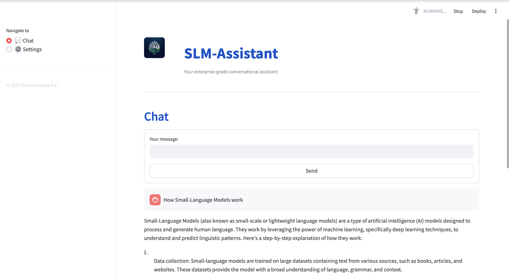

# SLM_GPT
This is a fully self‑hosted, privacy‑first Streamlit application that runs Microsoft’s quantized Phi‑3 “mini” 4K instruct model entirely on your local machine. You get a powerful chat interface, on‑device PDF document analysis, and voice transcription in one unified UI—no cloud APIs or external servers required.

**Key Features:**
- **Local LLM Inference:** Load and run the Phi‑3 mini 4K model from disk using efficient quantization (GGUF/GGML), ensuring all data stays on‑premise.
- **Multimodal Interaction:** Converse via text or voice, and upload PDFs for question‑answering or summarization directly in the browser.
- **Real‑Time Streaming Responses:** Display generated tokens instantly as they arrive for a natural, low‑latency conversational experience.
- **Configurable Context & Sampling:** Dynamically adjust the model’s context window (64–2048 tokens) and sampling parameters (temperature, top‑k, top‑p) to fine‑tune creativity and determinism.
- **Optimized for M‑Series Macs:** Leverage Apple Metal GPU acceleration, half‑precision KV caches, and direct C bindings for sub‑second first‑token times and smooth UI responsiveness.

Below you’ll find installation instructions, configuration tips, and usage examples to get SLM_GPT up and running in minutes.

## Prerequisites

- Python 3.8 or higher
- Git LFS (to handle large model files)
- [Hugging Face CLI](https://huggingface.co/docs/huggingface-cli/quickstart) (for model download)

## Installation

1. Clone the repository:
   ```bash
   git clone https://github.com/yourusername/SLM_GPT.git
   cd SLM_GPT
   ```
2. Create and activate a virtual environment:
   ```bash
   python -m venv venv
   source venv/bin/activate   # On Windows use `venv\Scripts\activate`
   ```
3. Install Python dependencies:
   ```bash
   pip install -r requirements.txt
   ```

## Downloading the Phi‑3 Mini Model

1. Log in to Hugging Face:
   ```bash
   huggingface-cli login
   ```
2. Download the quantized Phi‑3 mini 4K instruct model:
   ```bash
   mkdir -p models/phi-3-mini-4k
   cd models/phi-3-mini-4k
   git lfs install
   git clone https://huggingface.co/microsoft/phi-3-mini-4k-instruct .
   cd ../..
   ```

## Running the App

From the project root:
```bash
streamlit run app.py
```
This will launch the Streamlit UI in your browser at <http://localhost:8501/>.

## UI Preview

Below is a screenshot of the application UI:


